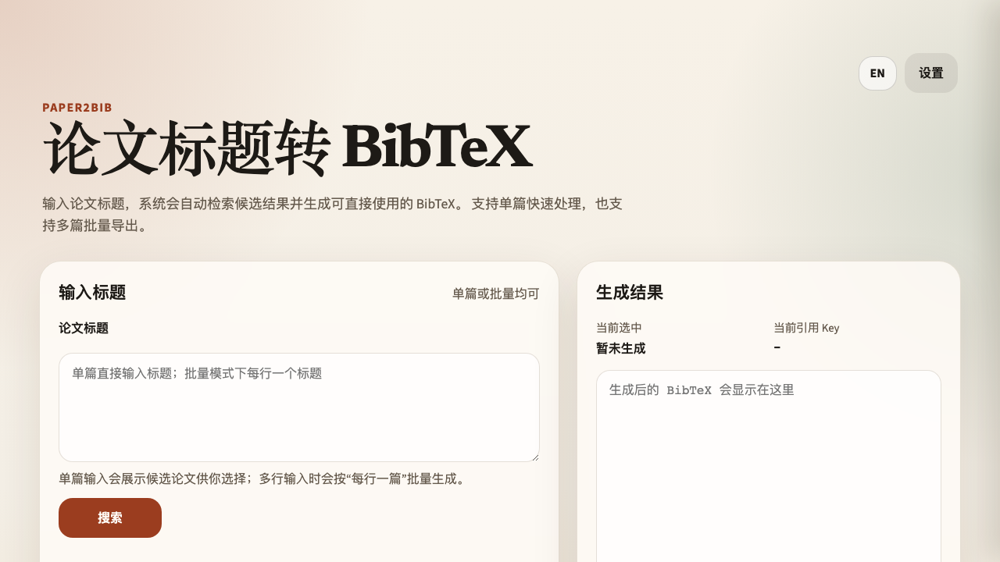
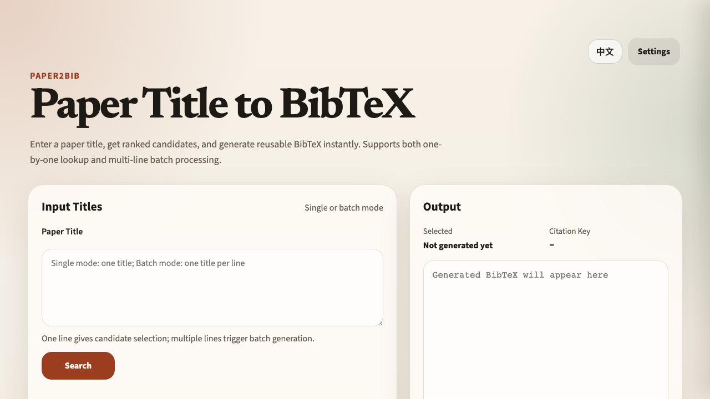

<h1 align="center">🫧 Paper2Bib</h1>

<p align="center">
  <a href="./pyproject.toml"></a>
  <a href="https://www.python.org"></a>
  <a href="./LICENSE"></a>
  <a href="./docs/index.html"></a>
</p>

<p align="center"><b>输入论文标题，快速拿到干净 BibTeX，让参考文献整理更顺手。</b></p>

Paper2Bib（`paper2bib`）是一个 Python 包和命令行工具，可通过论文标题搜索 DBLP 并返回干净的 BibTeX 条目。

语言：[English README](./README.md) | 中文（本文件）

## 你可以做什么

- 直接用论文标题搜索 DBLP
- 生成可复制、可导出的 BibTeX
- 批量转换长文献清单
- 保持参考文献条目命名一致
- 在 Web、CLI、Python、HTTP API 中复用同一套核心逻辑

## 安装

```bash
pip install paper2bib
```

## CLI 用法

单篇查询：

```bash
paper2bib "Attention Is All You Need"
```

批量模式：

```bash
paper2bib --file titles.txt --preference venueFirst --output refs.bib
```

## Web UI

可直接打开静态页面：

<p align="center">
  <a href="./docs/index.html"></a>
  <a href="./docs/en.html"></a>
</p>

<p align="center">
  
  
</p>

本地自部署运行：

1. 启动后端 API：

```bash
uvicorn dblp_bib.api:app --reload
```

2. 在仓库根目录启动前端静态服务：

```bash
python3 -m http.server 8000
```

3. 浏览器访问：

```text
http://localhost:8000/docs/
```

## Python 用法

```python
from dblp_bib import search_bibtex, batch_search_bibtex

single = search_bibtex("Attention Is All You Need", preference="venueFirst")
batch = batch_search_bibtex([
    "Attention Is All You Need",
    "BERT: Pre-training of Deep Bidirectional Transformers for Language Understanding",
], preference="venueFirst")
```

## HTTP API

```bash
uvicorn dblp_bib.api:app --reload
curl http://127.0.0.1:8000/health
```

## 项目结构

```text
docs/         前端静态页面（自行部署）
dblp_bib/     Python 包、CLI、FastAPI
pyproject.toml
setup.py
```

## 致谢

- 感谢 [DBLP](https://dblp.org) 提供论文元数据与书目信息生态。
- 感谢持续建设开源科研工具链的贡献者。
